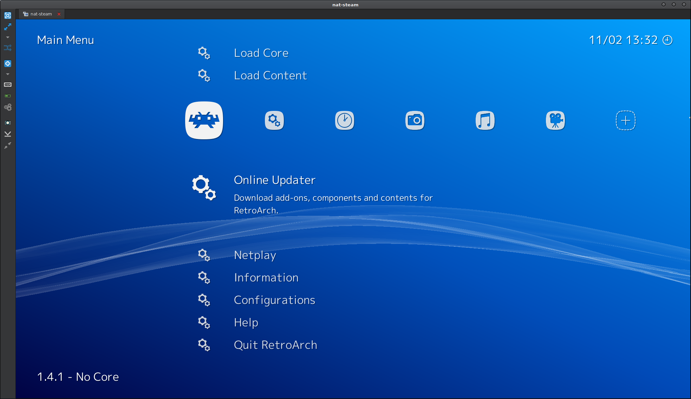
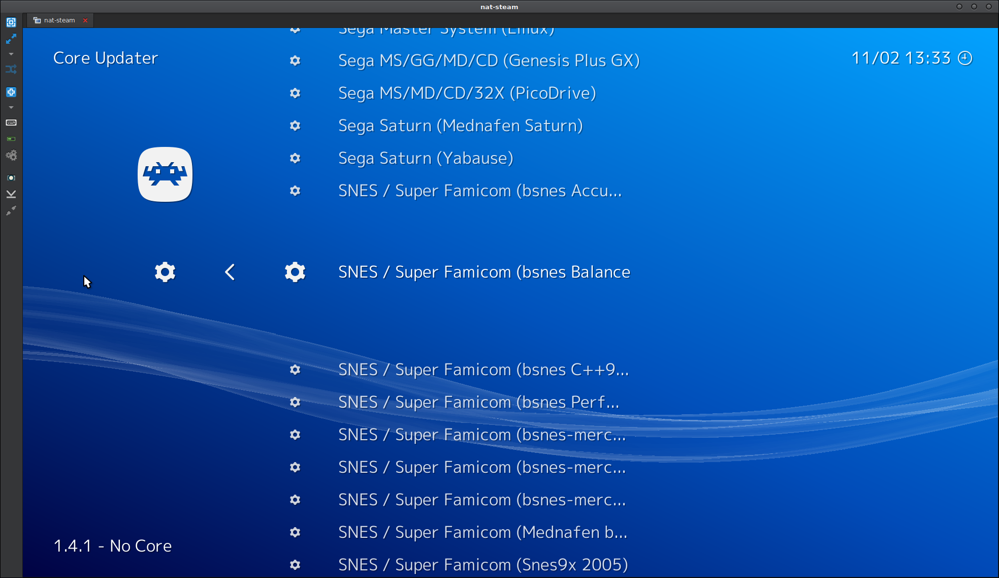

### Installing Emulators

Installing Emulators is the fun part, and beyond the scope of this guide to explain how to setup every single emulator. I will need to preface here by saying that you will need to read the emulator's documentation/guides/forum posts if you need further assistance per emulator.

You will often have one emulator per system as the author will focus on one system. However, some emulators work for two or more systems.

The backbone of many emulator setups will start with MAME, RetroArch to cover Arcade and many popular consoles. Then a number of specific emulators to fill the gaps not covered by the MAME/RetroArch combination.


There may be many choices for an emulator for any given system. There are different emulator projects by different groups, and they often each have strengths and weaknesses to each other. You may find your favourite game works better in a certain emulator, so you may need to try out emulators yourself.



Note that some Emulators require a BIOS file dumped from the console in question. This will often mean putting the BIOS files after being dumped from the console into a `BIOS` folder or the like.


There is a table of emulators on the next page to assist you in choosing emulators. To demonstrate an example of installing an Emulator, let's use [RetroArch] as an example, as it is good for running a huge amount of different emulator 'cores' in one programming, making it a bit of a go-to for lots of emulation setups.

Let's start by downloading RetroArch (libRetro) from its website, [https://www.libretro.com/][RetroArch]. There are links to the download site, where you can select platform, architecture, etc. Go ahead and download 'RetroArch.7z',

Then, unzip to `Emulation/RetroArch`.

That's the install done, and many emulators will be this simple to 'install'.

From here, you will need to sort out the emulator setup. This will be where you need to turn to documentation per emulator, tutorials, forum posts, etc.

Many you can just run the program and load up a ROM/ISO to ensure it works. Some will require a BIOS or 'core' to be downloaded first. Some will be even more complicated to setup.

For RetroArch, it almost works immediately out of the box. However, as RetroArch is a program that is a framework for multiple emulators (cores), it will not be downloaded with any cores currently. Run RetroArch, and select 'Online Updater' and then 'Core Updater'

You will get a big list of cores (emulators) to download. Each will emulate a console system and needs to be installed before it will run any games.

Select a core for the console you are looking to emulate. For this example, lets chose a core to emulate the Super Nintendo console. I've chosen 'bsnes_balanced_libretro' as the emulator, which is the bSNES emulator with settings balanced for a tradeoff between perfect emulation and performance


Note that emulators aren't perfect, and there will inevitably be the occasional glitch, missing texture, etc. It's difficult to perfectly emulate some system even on modern CPU's, so often taking a balanced emulator is a good tradeoff between performance and accuracy.


[RetroArch]: https://www.libretro.com/

