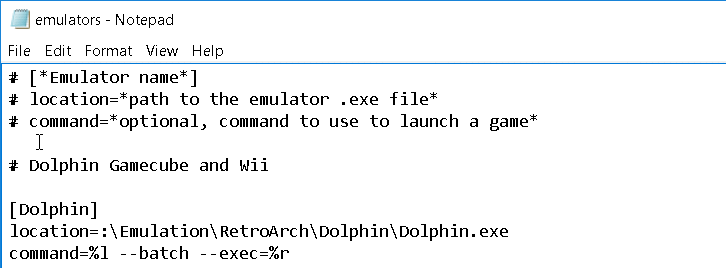
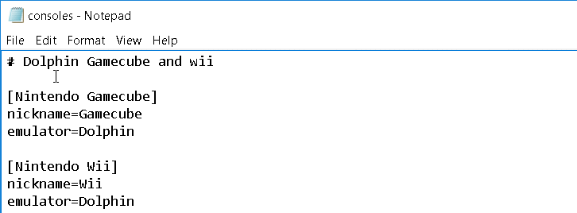
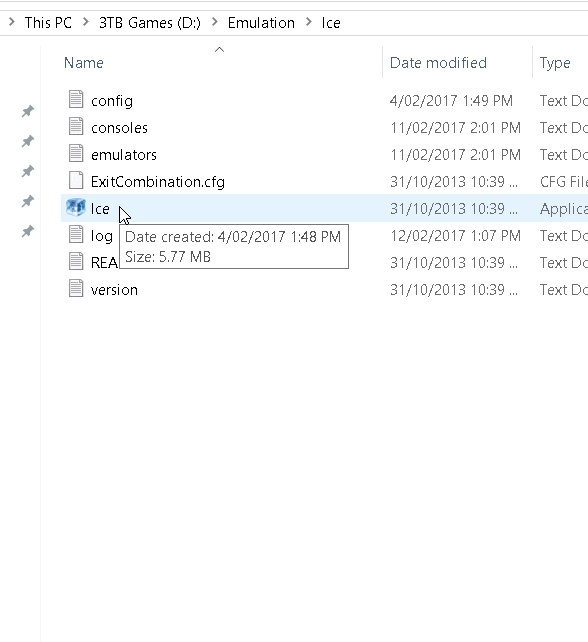
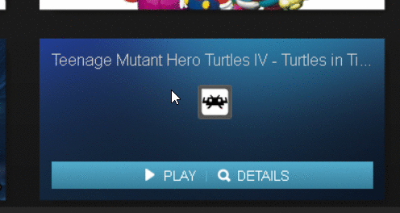

### Installing Ice

To install [Ice], we need to download it and extract it into a folder. I started an 'Emulation' folder to store this set up neatly.

Download the zip from the [Ice] Site, or perhaps check out the [Ice Github] site for an update. As of writing the app hadn't been updated in a number of years, unfortunately, however the old app did fine for the below job.

Extract the zip into `Emulators/Ice`

We will come back shortly to configure Ice, it will not do anything yet.

### Customise Ice Config

There are 3 files to modify in RetroArch. Note the general way Ice works is to browse your ROM directory, match each game to a console entry, link the required emulator for the console, and build a shortcut into steam based on the parameters for the emulator selected. It will then create, edit or delete 'Non-steam shortcuts' in steam for each game, and also attempt to download cover art.

**config.txt**

The only thing that really requires editing here is the `ROMs Directory` to match the location of your ROM folder.

**emulators.txt**

The best way to start a game neatly is by command line, most emulators will take command line arguments to pick the core, ROM, set fullscreen, etc.

For example, to run a RetroArch game now we could use the command line (Win+R, enter 'cmd') to run a snes rom by entering:

`RetroArch.exe -f -L .\cores\bsnes_balanced_libretro.dll c:\roms\SNES\rom.zip`

Which would load RetroArch instantly in full screen, load the bsnes emulator for Super Nintendo, and then load the ROM 'rom.zip'. RetroArch is happy to run with ROM's that are in zip files.

Enter a list of your emulators as you set them up. For this example, let's add in the bsnes emulator.
Ensure you change the folder paths to match your Retroarch location.

The command will take the following variables:

```yaml
%l = The path of the emulator, given in the location config line.
%r = The path to the ROM
```

Looking the RetroArch documents, we want to pass the `-f` argument to launch into fullscreen, the `-L` argument with a core path to tell RetroArch which core to emulate the ROM with, and then the ROM itself. The below will be the entry for this Super Nintendo emulator.

```yaml
[retroarch_snes]                                                                # name of this emulator setup
location=D:\Emulation\RetroArch\retroarch.exe                                    # Emulator executable location
command=%l -f -L d:\Emulation\RetroArch\cores\bsnes_balanced_libretro.dll %r    # Command line to build for steam shortcut
```



For example, the above setup would instruct Ice to build the following command if it was parsing for a game ROM located in `D:\Emulation\Roms\SNES\SNES_game.zip`

`D:\Emulation\RetroArch\retroarch.exe -f -L d:\Emulation\RetroArch\cores\bsnes_balanced_libretro.dll D:\Emulation\Roms\SNES\SNES_game.zip`

Repeat the process for all the emulators you've installed. Note the [Ice] site does have some command lines listed for some emulators to help get started. Each emulator will have a different command line set.

**consoles.txt**

In this file, we need to list the consoles we want to setup. Ice will use the details here to create folders within the ROM folder setup in config.txt. It will also use the names here to link each game to a category in Steam to allow for easy sorting by the console of the game.

This might feel like doubling up as you might think that we could just do it all in one file, but separating the consoles and emulators allows you to link one emulator setup to multiple consoles if the emulator supported it.

Add a block as below for each console you want to setup. Ensure you get the spelling right and ensure the entry for the emulator is a match for the heading for the emulator you setup in `emulators.txt`

```
[Super Nintendo]            # Title of emulator in Steam
nickname=SNES                 # Folder name in ROM's folder to scan for this consoles ROM's
emulator=retroarch_snes        # emulator to link to in emulators.txt that
extensions=zip                # file extensions to consider a game, separated by a comma 'i.e. zip, sfc'
```




Ensure you have the correct extension listed here, as it is easy to forget to change it. If you have a .iso game file and you have forgotten to change it from .zip for example, Ice won't find the game.


We should now have a working Ice setup.

### Copy ROM's

Now just to select some ROMS and copy them into the correct folders. I would suggest letting Ice run once as it will create folders in the `Emulation/ROMS/` folder for each console you have listed, using the nickname listed for the folder name.

Then copy ROM's or whichever file type the game dump comes into the correct folder.

### Run Ice

Ensure Steam is closed and run Ice and check the text that comes up at the command line for errors. You should receive a listing that it has detected all the consoles and emulators listed. It will then comment on linking each individual game that has been found, finally finishing up by downloading cover art.

If anything is missing from the output check the relevant config file.



If it was successful when you open steam you will be greeted with a list of games.

### Browse for missing cover art

If Ice couldn't find cover art for your game, you may need to grab some manually. Find and download a custom one (or even make some and share them back to the community?) at the below links:

- [r/steamgrid](reddit.com/r/steamgrid)
- [http://steambanners.booru.org](http://steambanners.booru.org)

The image should be 460x215. Once downloaded, switch to grid view in Steam, Right click and select `Set custom image`. Browse to the location of the custom image and select it.


You may need to change from `.jpeg` to `.png` depending on your file type in the file selection dialogue.




[Ice]: http://scottrice.github.io/Ice/
[Ice Github]: https://github.com/scottrice/Ice
