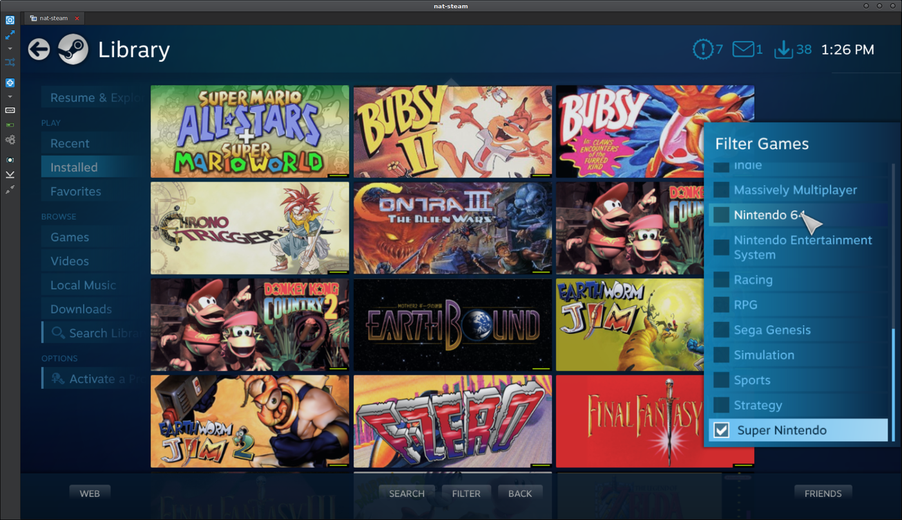

## Premise

I have set up my main television at home to be an all-in-one entertainment solution. It has Youtube, Plex, and live TV, which cover 99% of my viewing needs.
To round this out, I've set up a [Steam Link] to run my games from my gaming PC. This is an amazing setup that removes almost all reasons for owning a current gen console (except exclusives, but it's a small price to pay).

But what about old consoles like Super Nintendo, Atari 2600, etc.?

## Outcome

By the time we're done, we will have the ability to add any old console games to Steam as individual games through non-Steam shortcuts. This means that we will have a game listing for each individual game in Steam, which we can then launch. It will drop into the game fullscreen and ready to play, neat, tidy, using Steam's existing interface.

This, of course, means that it also works in Big Picture and Steam Link, allowing you to sit on your couch with an Xbox/[Steam Controller] and drop into any game of your choosing. You can also use categories to filter the Steam games list by console type and have grid art for each game.

We can do this by using a variety of emulators, with a GitHub project called [Ice] as the program that automatically adds all the games to Steam. You need only maintain a folder with the ROMs you want to have added to Steam, and when running Ice, it will scan for games in the folders and update shortcuts in Steam with entries for each game. It will build the correct command to launch the emulator and pass the necessary arguments to launch the game for each Steam shortcut.

This guide is aimed at Windows; however, I believe the [Ice] utility will also run on Linux.

For setup, we need to:

- Install Ice
- Install emulators
- Customize the Ice config for each game system and emulator
- Copy ROMs to the folder structure
- Run Ice with Steam closed
- Play old games using the Steam frontend.

[Ice]: http://scottrice.github.io/Ice/
[Steam Link]: 
[Steam Controller]: 
