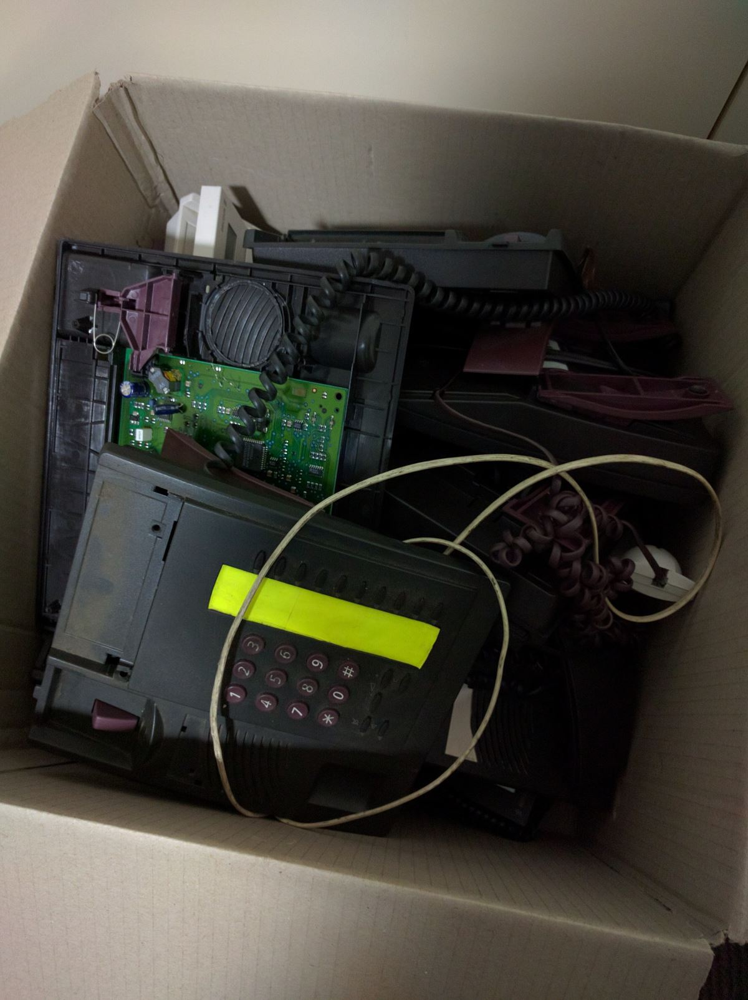
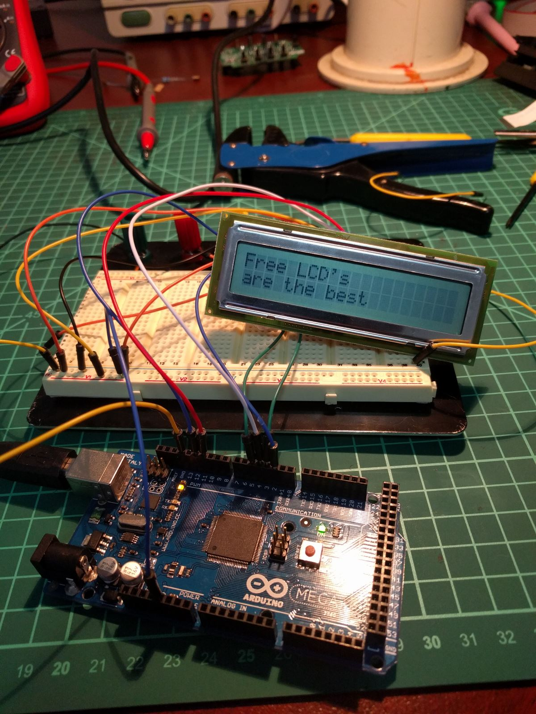
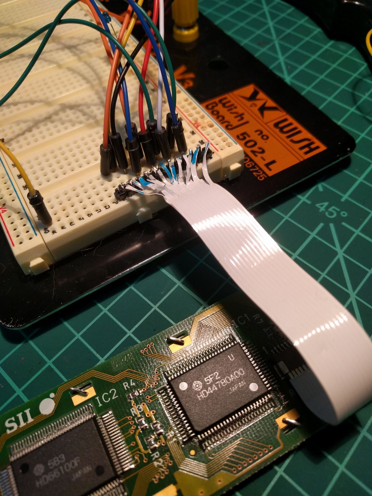

## Workplace preps to throw out 300+ phone units

We've upgraded our phone system for the entire business at work. When I piled the old Ericsson desk phone into the box they had set up to return the old phones the thought hit me - there’s a lot of speakers in the 300 odd phones that are being thrown out. Wait, forget that - I bet this LCD is generic.

So I took a few home and tore them down - and what do you know, but the LCD is a HD44780 based. I politely informed the IT dept they no longer needed an external contractor the throw them out, I would take them, thank you.

I wanted to ensure I could get it working before grabbing them all. While I am yet to receive the MCU programming kits I’ve ordered, so I found an old Arduino Mega I had lying around from the 3D printer build. Whilst this should have been a simple check, Murphy, of course, got me - the ribbon cable pin pitch width was just too small for me to solder on my own ribbon cable to break out onto a breadboard. I had a few goes but the two sizes of ribbon cable I had on hand were the right width and bending the pins to neatly marry up with the solder pads just wasn’t working for me.



## Getting a salvaged 10 pin HD447800 LCD working

My solution to break it out was to slice up the individual wires from one of the actual ribbon cables from the phone and solder it to a 12 pin header. The challenge here was that most HD4480’s are 16-pin - and this puppy had a 12 pin input. I did notice that 2 pins weren’t apparently connected by a quick scan of the PCB, and assuming it was actually a 10 pin LCD some googling revealed the following pinout.



```
1: Gnd
2: VCC (5v)
3: Contrast (10k pot)
4: RS
5: R/W
6: E
7: DB4
8: DB5
9: DB6
10: DB7
```

And the header of the Arduino Liquidcrystal library includes where to connect the pins of the Arduino to the LCD.

```
 * LCD RS pin to digital pin 12
 * LCD Enable pin to digital pin 11
 * LCD D4 pin to digital pin 5
 * LCD D5 pin to digital pin 4
 * LCD D6 pin to digital pin 3
 * LCD D7 pin to digital pin 2
 * LCD R/W pin to ground
 * 10K resistor:
 * ends to +5V and ground
 * wiper to LCD VO pin (pin 3)
```

From there it’s easy enough to connect the dots. So no backlight, but a perfectly working 2x20 LCD.



[liquidcrystal]: https://www.arduino.cc/en/Reference/LiquidCrystal
[10pinlcd]: http://ask.metafilter.com/107529/Identify-LCD-panel
