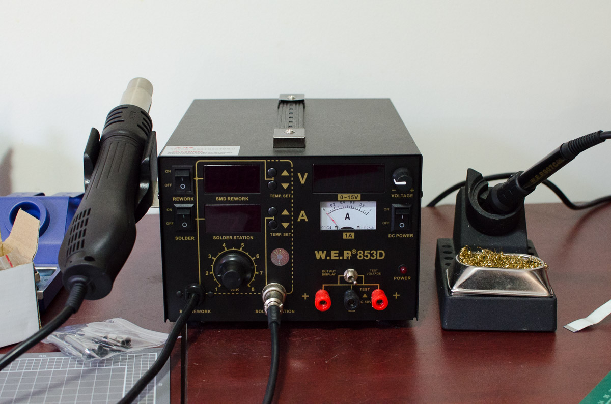
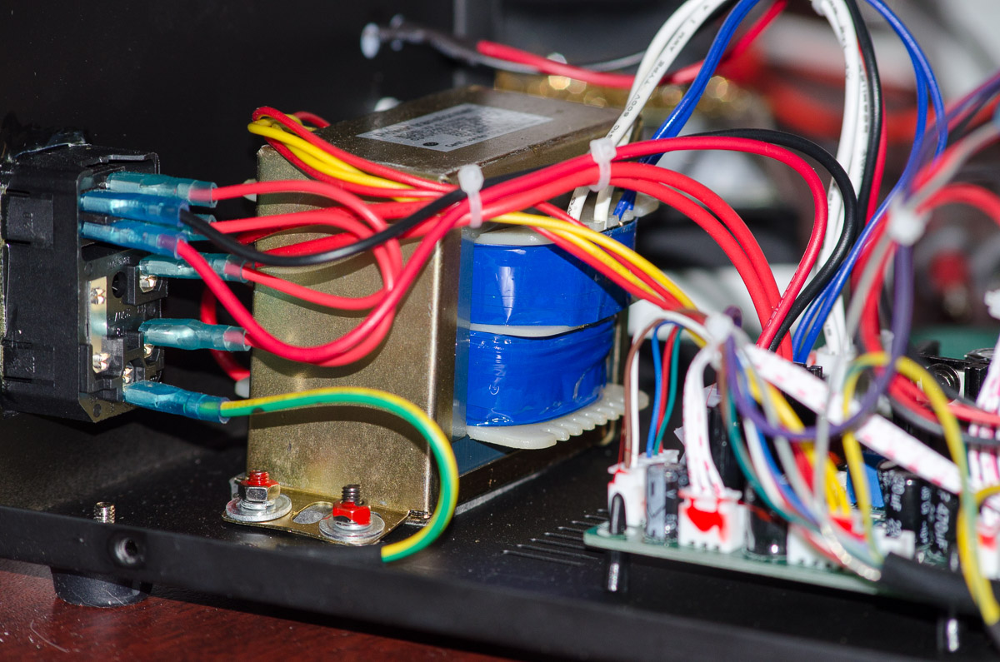
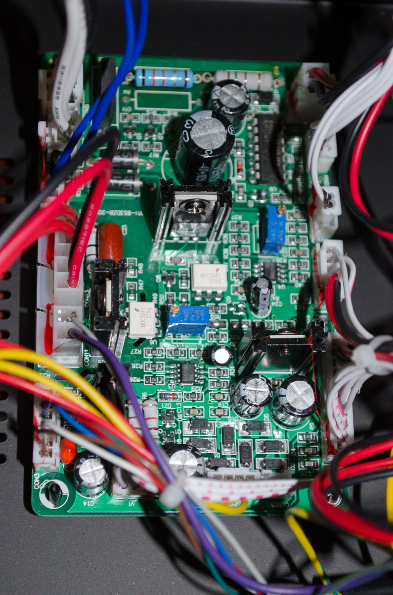
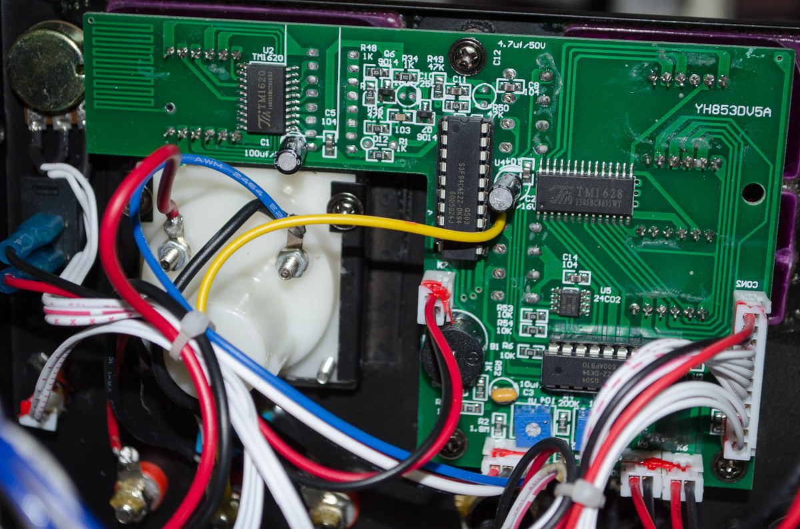

## Time for an upgrade, from cheap solder pen to cheap solder station.

After living with an old non-temperature controlled soldering iron for years I decided it was time to upgrade. I had been using a Goot PX232 for a long time, and before that some Jaycar $15 iron that was only just passable as a soldering iron.

Now, despite the fact I _should_ be getting a decent brand, I decided to try a cheap eBay clone. I found a 'W.E.P 853D Soldering Station/Hot Air Gun/DC Power supply' on eBay, within Australia. Few days later I have it in my grubby hands.

I've been perfectly happy with the operation. I've had it now for a few months with no issues.

The soldering iron has tips that fit over the cartridge, it heats up quite nicely. It comes with a large variety of tips (conical, chisel, wedge) and sizes. The iron holder is pretty lousy and the tip will hit the rear of the case and lean against it. I've continued to use my old iron holder due to this. Its such a relief to be using decent bits now after struggling along with conical for so long.

The iron heats up to 300&deg; C within 47 seconds, so on that side it's not so great, unfortunately.

The hot-air gun comes with a few tips to have wider/smaller airflow.

The power supply I only used a little, but it was accurate to its displayed measurements. I haven't had much experience at measuring power supply ripple so will skip that for now, but I can't say I've noticed or seen much ripple on my oscilloscope.

## Teardown

Finally, that's out of the way. I had to have a look see inside - would it be complete cheap Shenzhen market garbage? Or would it be somewhat passable. More importantly, was it a Yihua station with a different name like I suspected?

Presentation was quite nice. My preference is the black and gold to the gaudy blue and yellow others have. Buttons have a nice tactile feel to them and knobs are firmly stuck on and feel OK considering. LCD is clear and bright.

I won't profess to be any good at a teardown, but the transformer seemed OK, earthed down to chassis with decent connectors. Power transistor is well secured (housed on the rear of the chassis). I know people have concerns about cheap Chinese equipment such as this being a fire hazard - but I didn't see anything that concerned me. I've seen worse build quality from gear built in better countries and companies that was worse.

PCB in the middle of the board hosts some TRIACS, bridge rectifier, MMOC3041 optocouplers, and various passives. Caps are no name ([Jwco]) garbage, but at least the TRIACS have heat sinks. A single LM723 voltage regular sits on the board. Soldering seemed perfectly fine, looks wave soldered (or at least reflowed)

The control panel has two S3F94C4EZZ MCU's and two LED display drivers (TM1620 & TM1628). Can't determine the manufacture for the MCU's, I get either a Samsung or Zilog part - I'll leave you to guess which I think is the more likely manufacturer. Not much else happening there, soldering continues to look fine. I can't see any post-production fixes or anything untoward dodgy - if I had been given the photos to look at without knowing where it came from it would look visually OK to me.

Wait a minute here - the control PCB has a silk-screen designator of 'YH852DV5A'. Clearly the same control board as the Yihua model. After some googling I found an [EEVBlog post](eevblogpost) regarding the Yihua which showed a photo with an identical control board, but what to me looked like a significantly worse power board.

Meanwhile, whilst I wait to see if Shenzhen lets me down again I will continue to enjoy my nifty little soldering station.

[eevblogpost]: http://www.eevblog.com/forum/reviews/new-toy-yihua-853dplus-rework-station/
[jwco]: http://www.jiaweicheng.com/EN
[s4repairpost]: http://127.0.0.1:4000/electronics/s4-soft-button-repair/
