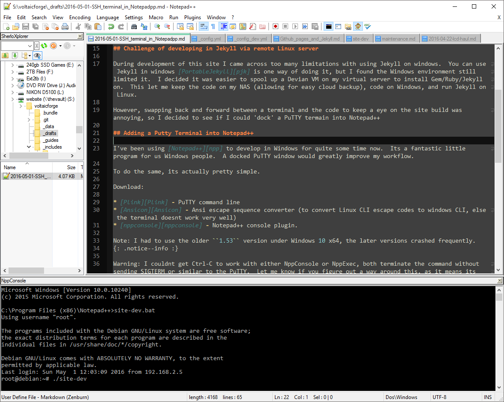
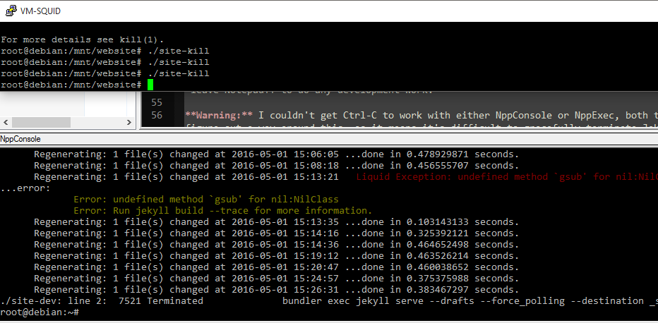

## Challenge of developing in Jekyll via remote Linux server

During development of this site, I came across too many limitations with using Jekyll on Windows. You can use Jekyll in Windows with [PortableJekyll][portablejekyll], but I found the Windows environment still limited Jekyll. Mainly ImageMagick for using responsive images, which isn’t worth the hassle of setting up on Windows. I decided it was easier to spool up a Debian VM on my virtual server to install Gem/Ruby/Jekyll on. This lets me keep the website code on my NAS (allowing for easy cloud backup), code on Windows, and run Jekyll on Linux.

However, swapping back and forward between a terminal and the website code to site build was annoying, so I decided to see if I could ‘dock’ a PuTTY terminal into Notepad++

## Adding a Putty Terminal into Notepad++

I’ve been using [Notepad++][notepadpp] to develop in Windows for quite some time now. It’s a fantastic little program for us Windows people. A docked PuTTY window would greatly improve my workflow.



To do the same as I have above, it’s actually pretty simple.

Download:

- [Plink][plink] - PuTTY command line
- ~~Ansicon~~ - (Git repo defunct) Ansi escape sequence converter (to convert Linux CLI escape codes to Windows CLI, else the terminal doesn't work well)
- [nppconsole][nppconsole] - Notepad++ console plugin.
  
  I had to use the older `11.53` ansicon version under Windows 10 x64, the later versions crashed frequently.
  

The do the following

1.  Extract _NPPConsole_ to your Notepad++ plugins directory (Program Files x86/Notepad++/Plugins)
2.  Restart Notepad++ if it's running
3.  Unzip and copy _plink_ and _ansicon_ to a folder of your choosing (I put them both in the Notepad++ folder as it's where the CLI defaults to, and I’m lazy)
4.  Open a CLI at the Notepad++ folder and run `ansicon.exe plink.exe -ssh user@location -pw yourpasword`, replacing the relevant parts with your user/server IP/password.
5.  All going well, you can now replicate that command in Notepad++. Open Notepad++, select _Plugins -> NppConsole_ (should be there if you restarted and copied the dll correctly). Run the command and you are set!

If you have a saved profile in PuTTy you can replace the command with `ansicon plink -ssh SESSION_NAME` , replacing `SESSION_NAME` with your sessions name from the PuTTY dialogue. This works with key authentication as well, which I much prefer to use. This also saves you the risk of keeping a plaintext password in a potentially insecure location.


You can use the plugin Nppexec as well instead of NppConsole - but I prefer Nppconsole for this.


You now have a working CLI in Notepad++ that can call an SSH session. I wrote a few batch scripts, so I just have to run `site-dev` in Windows to jump to my Linux VM that contains Jekyll, then `./site-dev` to run a bash script to call up Jekyll in dev mode. Already having made a `site-push` bash to push the site to Amazon AWS, so I don’t need to leave Notepad++ to do any development work.

I couldn’t get Ctrl-C to work with either NppConsole or NppExec, both terminate the command without sending SIGTERM or similar to the PuTTY. Let me know if you figure out a way around this, as it means it’s difficult to gracefully terminate Jekyll. Workaround below.

## Workaround for no Ctrl-C to exit Jekyll

My workaround for this has become to have a PuTTY terminal open just for stopping Jekyll. This isn’t as bad as it sounds. Just write a bash script to kill ruby as follows:

```bash
pgrep ruby | xargs kill
```


This will kill all ruby threads! Note this if you often have other ruby threads often running


I saved it as `site-kill`. My workflow is `site-dev` for the development of this site (with dev flags for config, etc.), `site-push` to rebuild the site from scratch and push to AWS. The new `site-kill` kills off any ruby threads.



## Bonus - Markdown highlighting in Notepad++

The default colours finally made me crack during writing this post. Too much white! The language highlighting file I had for Markdown didn’t play ball with custom styles.

I found a language highlighting file for Markdown on [GitHub][markdownhighlight] that had a file for the Zenburn colour scheme. This is what you can see in the screenshots above. So much better!

[portablejekyll]: https://github.com/madhur/PortableJekyll
[notepadpp]: https://notepad-plus-plus.org/
[plink]: http://www.chiark.greenend.org.uk/~sgtatham/putty/download.html
[ansicon]: https://github.com/adoxa/ansicon/downloads
[nppconsole]: https://sourceforge.net/projects/nppconsole/
[markdownhighlight]: https://github.com/Edditoria/markdown_npp_zenburn
