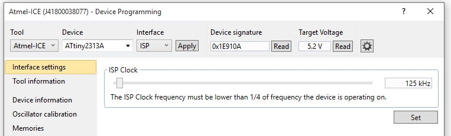
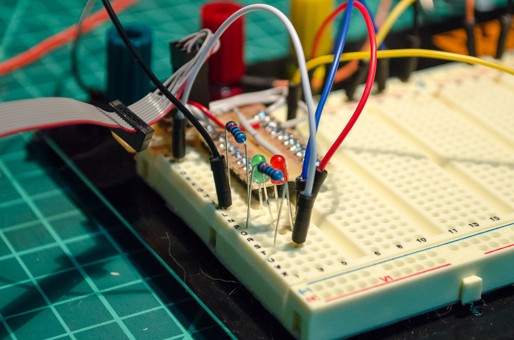
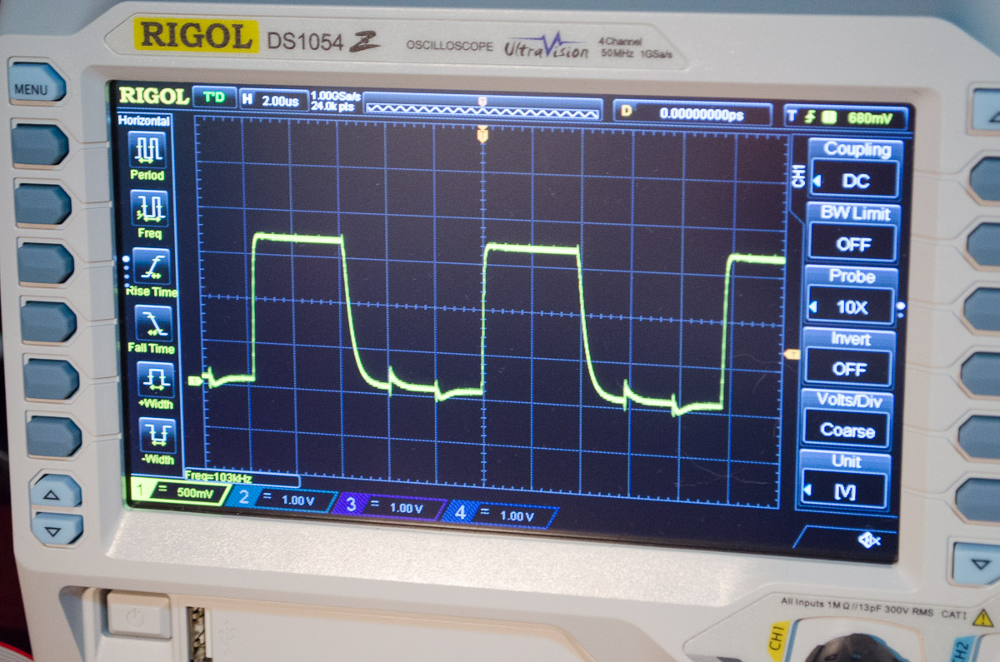

## Testing out new AVR Gear

Well, I’ve received the new programmers I ordered. Amongst them was the [Atmel ICE][atmelice], which I have chosen to be the first thing I would test.

I’ve been meaning to get fully into MCU development, but I have to say that the Arduino craze didn’t really grab me. A sketch? Shield? Buy pre-assembled gear and push it together, copy and paste code?

Pass. I prefer to code, learning and assembling circuitry myself and learning code from examples.

I’m actually struggling a bit to find decent tutorials for MCU programming (I can’t be looking in the right places). However, it wasn’t too hard to figure out the pinout of the Atmel-ICE and compare to the pinout of the ATtiny 2313A using the data-sheets. I build a miniature shield that plugged in over the top of the MCU and had a neat little 6-pin plugin header (I may cover it in another post).


The Atmel-ICE data-sheet nicely doesn’t include the direction of the tab in the user guide. The pinout on the user guide doesn’t include the tab on the 6-pin connector. I have added it to the data-sheet image below - the tabbed connector is on the side of MISO, SCK and RESET (for SPI programming)


So after plugging in the programmer I confirmed all was well in Atmel Studio 7. `Tools -> Device programming` gets you to the device programming screen, and selecting `Atmel-ICE` tool and your chosen device (in my case I had the ATTiny 2313A, so I selected `ATtiny2313a` from the device selection). The interface is `ISP` and you can click Apply.

Once this has been selected, you should be able to click on Read for the device signature. If it reads an address and target voltage, you have succeeded.

I proceeded to load up a blinky led program to confirm all was well, and well, all was well.

Out of curiosity, I was interested to know the maximum frequency this would have out of the box on the output pins with no `_delay_ms()`, with its default 1Mhz clock cycle (8Mhz internal oscillator with the CKDIV8 fuse clocking it down to 1MHz)

Whilst I did leave it with two I/O operations per cycle, I did come up with a frequency of 103khz.

[atmelice]: http://www.atmel.com/tools/atatmel-ice.aspx
