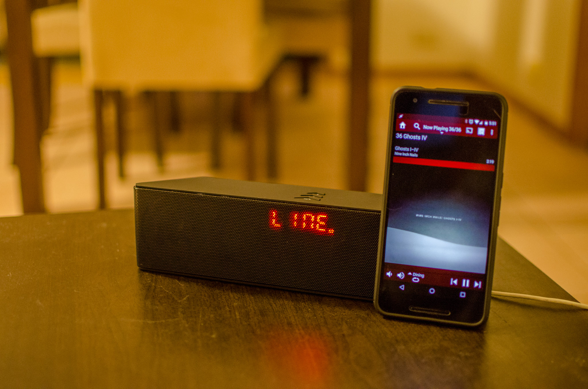
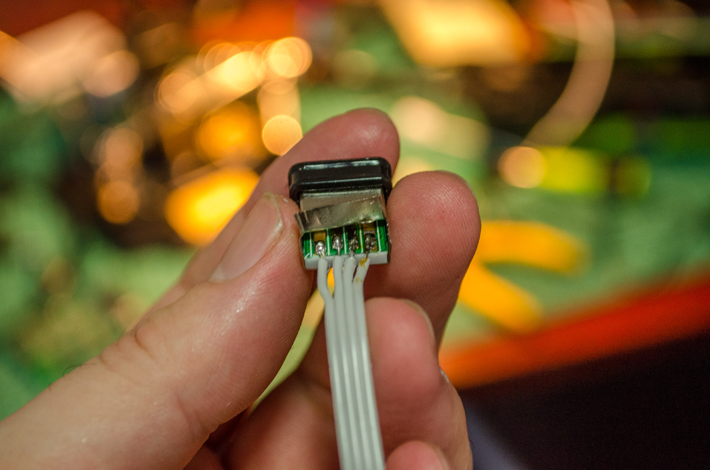
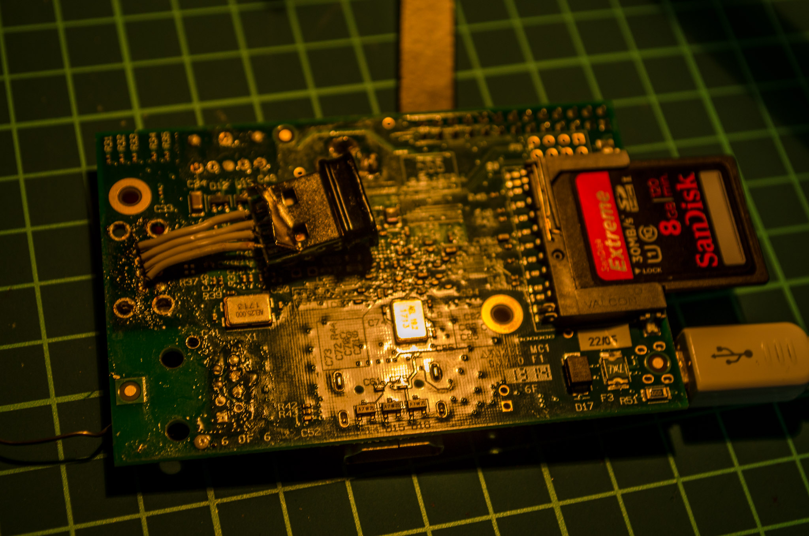
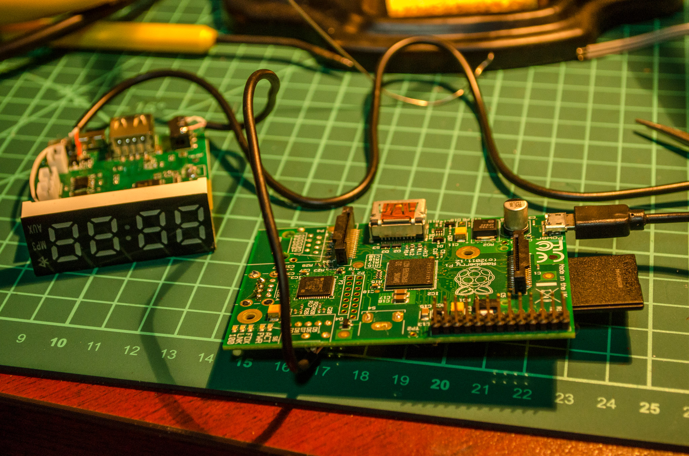
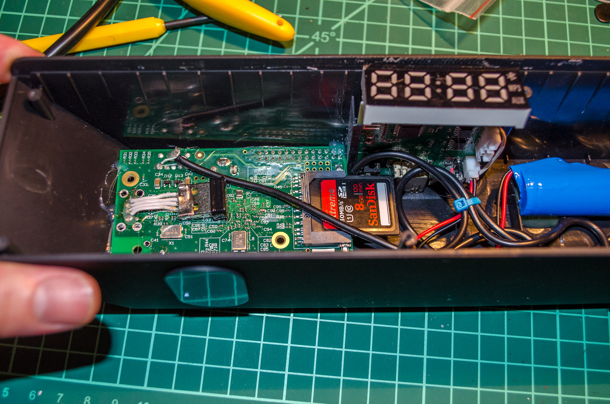

## Multiroom Audio with the Raspi

I've wanted some sort of audio system for years, a set of speakers in multiple rooms you could setup to be controlled via an app that would be able to play my music collection, and radio. In the past I've experimented with just having iTunes on a laptop with speakers solely for it, putting speakers on my server and some other options. None have ever hit the 'neat and tidy' aspect.

Recently I started playing around with the RasPI squeezebox solution [piCorePlayer][piCorePlayer] which was a big step in the right direction I was looking for. Surely I could find a cheap set of speakers that would look neat, but have enough space to squeeze (pun intended) a RasPi inside of?

Off to AliExpress I went and found a cheap(ish) little Bluetooth speaker set. It actually had a decent set of features, pity I would not be using most of them.

Above is the finished player (which looks the same as how it comes out of the box). I managed to fit a RasPI 1 inside of it, wired up to the power and aux input jack. The PI connects wirelessly to my wireless network by a Wifi dongle and runs off the Logitec Media Server software. So via an app or internal website I can play music or radio and media server will kick off the RasPI to play, pause, volume, etc.

It's truly a poor man's [Sonos][Sonos].

## Hacking the speaker

The speaker is a cheap Bluetooth-capable speaker off AliExpress. It's got more functionality than I wanted but was the only one I liked the look of that could potentially fit a RasPI. I got it Friday night and quickly tore it down.

I found that it indeed did have enough room to hide a RasPI. But only just, and only after the RasPI has undergone some radical weight reduction. I setup a wifi dongle I had lying around to run on the RasPi and verified it worked before proceeding - I already had Logitec Media Player on a virtual machine running on my server.

I then played around and inspected the circuitry to find where I could hijack power from the speaker power. It had a power input which was just a standard micro USB-B connector, so it would be running +5V which I could just tap the RasPI into. I cut one end of the USB to Micro USB-B connector that came with it and soldered it to GND and the closest point I could tap +5V. I suspect it was a regulator to drop to +3V or so - the lithium battery included only had 3.7V in it so one would suspect the logic to be +3V. I tried pulling direct from the battery charge points but it only gave out 4.7V, which the RasPI flat out refused to boot on.

I did accidently blow a resistor to GND during probing for voltage (which a bodge wire quickly fixed, shorting the plugs housing to another GND point on the board).

Then it was on to the drastic reduction - the RasPi would have to havethe RCA plug, line-out, Ethernet and the USB plugs stripped. I either cut or desoldered these as what was easiest (cut off all but the Ethernet and USB, which required adding fresh solder and then sucking it out). The solder on the RasPI melts a LOT hotter than usual, so adding fresh solder was the trick.

After the rapid weight loss, I had to find a way to get the USB wifi adaptor back on it. I threw any concept of the USB spec out the window and directly connected the USB pins to the WIFI dongle with a ribbon cable.

After everything, it looked a little worse for wear but it worked fine. Then I started probing around to figure out how to connect the Pi's line out direct to the speaker system.

I bodged wires from the aux input jack of the speaker system to the pi - guessing the left and right channel would be the pins connected to the capacitors I could see on the board. The centre pin turned out, as I suspected, to be ground.

I tested it as it was and it worked. The speakers had some bad line noise (as you'd expect from a cheap set) so I turned them right down and the Pi right up. Once I had done that, it was great!

Afterwards, it was merely a case of fitting the PI into the housing and it fit like it was designed to be there. Some hot glue and a zip tie, and it was time for reassembly.

Once reassembled, it looked like it was new out of the box. All it required was a home to be found for it and for it to be plugged in with any old wall plug & USB Micro B cable. Once it's powered up, the PI boots up into piCorePlayer, connects to the Wifi, and is ready to receive music or radio streams! Just running the Andriod app [Squeeze Ctrl][app] allows me to control the Logitec Medis Server, which finds the RasPi and considered it an output device. A tap of the app and we have music control.

All I need to do is order a few more and I have a Sonos-like experience, for a fraction of the price.

[piCorePlayer]: https://sites.google.com/site/picoreplayer/home
[app]: https://play.google.com/store/apps/details?id=com.angrygoat.android.squeezectrl&hl=en
[Sonos]: http://www.sonos.com
