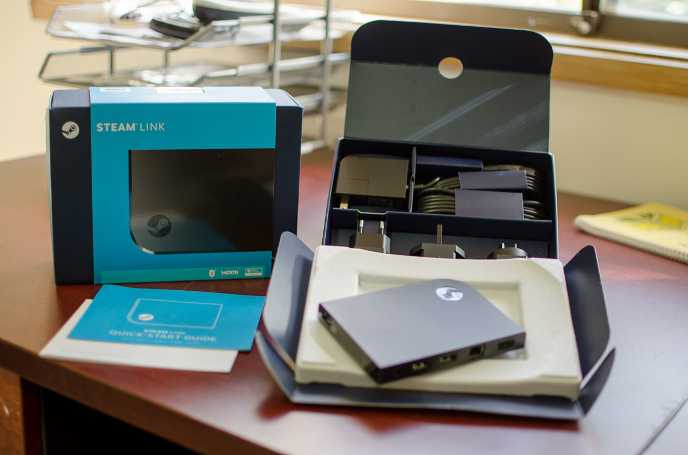
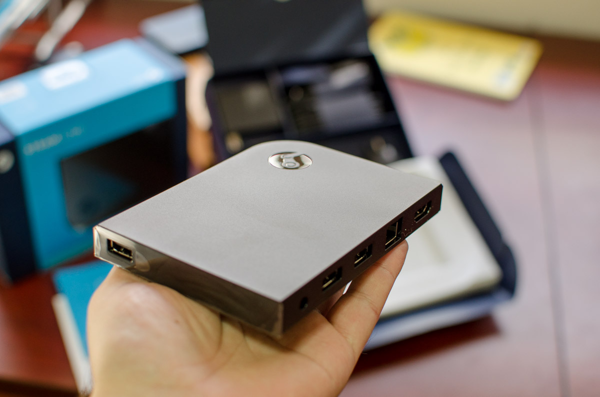
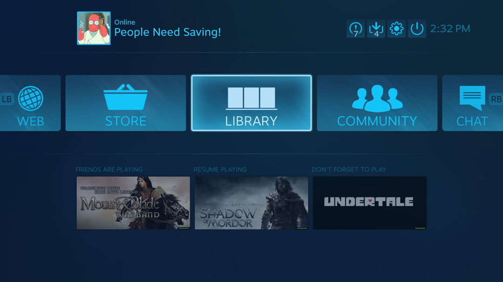
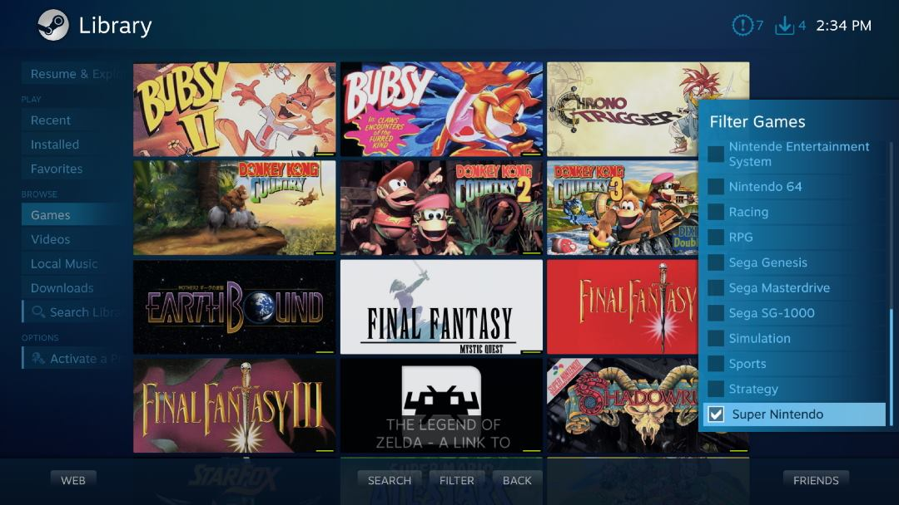

## Why Steam Link and what is it?

In short, Valve's [Steam Link][steamlink] is a small box (not much larger the size of a deck of cards) that you can plug into your network and TV and stream games from your PC to your TV, in glorious 1080p @ 60hz. It also takes care of ensuring your controllers talk to your PC, and turns on like a console via turning on your controller. If you ever wanted to play your PC games from the couch with a controller, this is for you. If you have a wired network already it is literally as simple as plug into TV and Ethernet, plug in controller adaptor/pair with Bluetooth, enter PIN on PC running steam, and you are literally playing games from your couch within 5 mins.

If you ever wanted all your emulation in once place, your modern games playing friends side by side with Zelda, Super Mario 3, River Raid, Sonic or perhaps even Goldeneye, you need to get this!


I have written a guide for neatly setting up emulators to work with Steam Big Picture/Steam Link. Check it out [here](link \_steam_emulators/premise/index.md)


> _**I call it the ultimate console.**_ Who doesn't want all your games in one place - from Atari to the latest releases?

Unfortunately, it appears there's so much confusion about it - if you read the review articles or forums there it appears there's confusion about what it is, or who it is for. Unfortunately many of, the reviews for the Steam Link are lukewarm at best for reasons that I don't feel are valid. Comments such as input lag or artefacts make me think reviewers simply haven't tried changing a single setting to adjust - and they are simple to fix.

However, I will note that I expect any Wireless connection will introduce input lag (doesn't matter how fast/good it is, radio waves are slow things compared to the speed of an electron) - if you can't hardwire a Steam Link I don't think this is for you.

I used to have an HTPC each for the Projector and the TV, running Plex and Steam for Steam Streaming. It wasn't particularly polished, and felt clunky, either using a Xbox 360 controller or an IR remote setup.

Recently, I upgraded to a shiny new 70" LG 4K TV. This removed the need for an HTPC for Plex and YouTube. Using the TV's remote to browse the in-tv apps for Plex and YouTube was amazing, and far superior to anything I could have down with the HTPC.

So, now the HTPC was only doing Steam streaming, it was time to find a solution for retiring the HTPC completely. Enter the Steam Link.

I think there is confusion and trepidation on Valves latest gear. Not everyone seems quite sure what is it.

The Steam link is merely a device to stream your PC's screen to an HDMI device (i.e. your living room TV). It doest play the games, it merely extends your PC's reach. But it's also so much more.

The Steam link is a little black box with a small, unobtrusive steam logo that includes

- 3 USB2.0 ports
- HDMI out
- 100mbs Ethernet
- Power input
- Bluetooth 4.0
- Wireless AC
- Works with Xbox controllers (requires dongle), a ps4 controller (Bluetooth, no dongle), racing wheels, keyboard/mouse (wired and wireless), just about any input.
- Comes with various power point adapters for various regions (AU, US and probably EU)

That's about it. It runs off an ARMv7 with a dedicated h.264 hardware decoding, custom Linux kernel. Technically speaking, it's comparable to a Raspberry Pi 2. And don't get scared off by the 100mbs ethernet - if you do the math that is more than capable of 1080p @ 60hz.

But it will stream from your PC at 1080p @ 60hz if your gaming PC is up to the task. Not only that, but with Big Picture it will do this seamlessly with a nice, functional interface, it will manage your controllers (Xbox, PS4, racing wheel, etc), and it works like a console. Hell, it's so tiny that it is easily hideable behind any TV - my wall mounted TV has no need for a shelf to put a bulky console on.

> Note it is best paired with a Steam Controller. I've done a short write up on the Steam Link [here]().

## One week with the steam link.

It's been a long time since I've been so impressed with a tech purchase. It runs a dream, plays games at 1080p @ 60hz, and as completely unlocked me from being hunched over the PC to game.

My living room TV has become the go-to place in the house (I haven't even wanted to fire up the projector since I got this!). Once I've finished watching a show over dinner, I can hit the logo button on the Xbox controller or my Steam controller, turning on the Steam link. Any controller 'just works' assuming you have the PC dongle (for a Xbox controller) or a PS4 controller will connect via Bluetooth, no dongle necessary. You can choose to connect a keyboard/mouse as well with no issues, again it 'just works'

From here, you are presented with a menu of the available PC's detected on the network you have setup. Adding a PC is as easy as selecting it and entering a PIN code on the PC - only required once to pair. On subsequent boots, all you have to do is select the PC from the menu.

From there, it's all over to the PC in terms of work - the steam link will request the PC to go into big picture mode and begin streaming the window. From your seat, at the TV it seamlessly transitions to the Big Picture launch intro.

Then it's just like using Big Picture on your PC. You have a nice interface for the store, your library, etc. Launching a game will drop you directly into the game and big picture will jump to streaming that window without you noticing any transition. It's just like having a console - but it's your PC!

This has opened up a realm of games that I've wanted to play but didn't want to hunch over the PC with a controller.

## Running emulators on the steam link

Now, if you are like me and you love emulating old games - you're in for a treat. You can ditch fiddly front ends and use steam to manage your games - and stream them via your Steam Link as if you had your SNES, N64, Playstation, Atari, Sega, whatever plugged in. A GitHub project called [Ice][ice] can be setup to run through a ROM directory, and manage adding/removing a custom game to your steam list that will launch an emulator of your choice, passing the game as a command and launching the emulator directly into the ROM.

I've written a guide [here]() covering how to set this up.

As a result, I have a multitude of my favorite old games in my steam library (complete with artwork, and tagging the game with the console name). From my couch, I can thus filter my game list into the "SNES" category, and see a list of SNES games. Launching one will drop directly into Retroarch with bsnes core with full controller support. Dropping into a emulated game instantly at a button press and getting the intro screen for the console of choice is mind blowing - it's like having a SNES or N64 plugged into your TV. All this in a package the size of a pack of cards.

So I can go from Shadow of Mordor to Donkey Kong Country to Pitfall, all within 20 seconds of each other using whatever controller I chose.

## Why is this better than a console?

I can think of a multitude of reasons

- Emulator support - build the ultimate console! Heck, play old DOS games with DOSBox and a Steam controller!
- Mod support! You get the modding of PC, with the comfort of couch and controller (or keyboard/mouse if you still choose)
- Better graphics - sorry, but a decent PC will plain outperform a console, especially as the console lifecycle drags on.
- Massive games library, not bound to one manufacturer
- Multi-room support - move from TV to Home Theater to PC. Or connect to different PCs with different steam accounts running.
- Customization - especially with a Steam Controller, customise to your hearts content either the game or the control set.
- Games are plain cheaper on PC with Steam Sales.

The downsides

- **MUST** be hardwired! I can't see any solution on wifi that won't introduce too much input lag
- Comes with the inherent possibility of crashes on PC - Steam has bugged out on occasion.
- The odd console exclusive game
- Requires decent PC (mind you, I'm running MGS:V at 1080p @ 60hz with a Nvidia 670 no problems)

## Closing thoughts

If you haven't already run out and bought 10 Steam Links then I don't know what's wrong with you and you require professional help. Assuming you have a wired network and can't/won't have your PC directly hooked up to your TV, this is for you.

I have had nothing but perfect streaming experiences, smooth FPS, no artefacts, lag, etc. That said, I have built a robust network, it is wired, and I have given it an optimal network to run on - and it is delivering in spades. If you want to run on Wireless then it's your funeral - even with AC dual band, you're going to get input lag. I think it's a simple fact of the way wireless works.

Also keep in mind that when you stream you are also asking your PC to run the game AND encode the audio/video - this means you need the grunt to run the game at 1080p as well as the stream encoding overhead.

[ice]: https://github.com/scottrice/Ice
[steamlink]: http://store.steampowered.com/app/353380/
