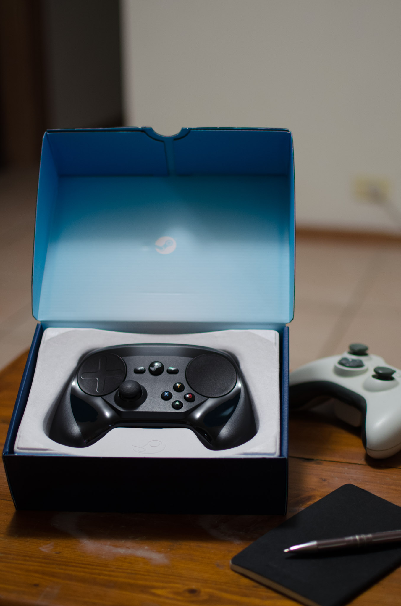
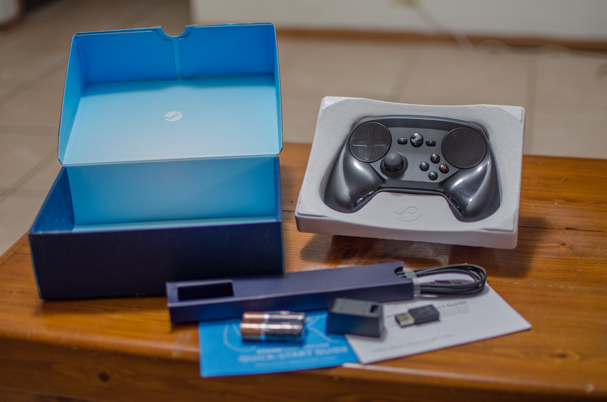
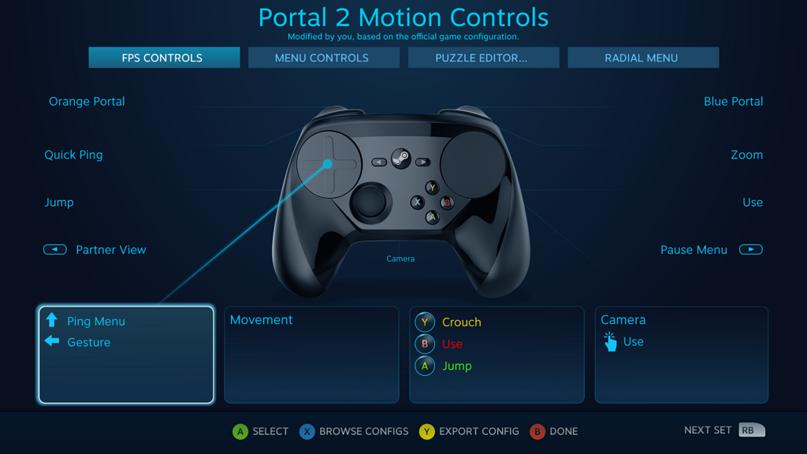
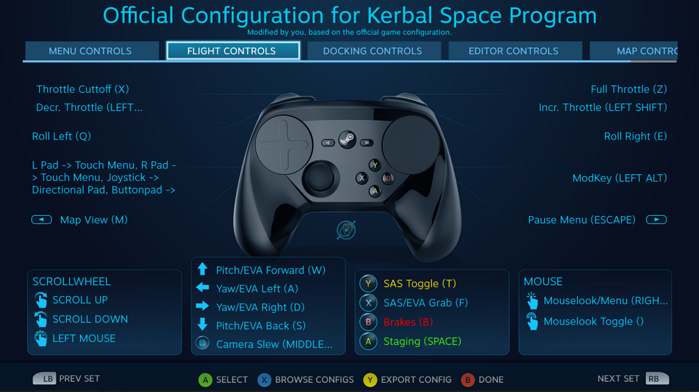

## What is the Steam Controller?

The steam controller is Valve's offering into the controller segment. With the launch of their Steam Link and upcoming Steam Box offerings, Valve decided to continue their campaign to bridge the gap between PC games and the living room by designing a controller with PC games in mind.

The Steam Controller boasts 2 trackpads, haptics, by my count 18 buttons, 2 dual-stage analog triggers and an analog joystick. Two of the buttons hide on the bottom of the controller that double as the battery housing - when your fingers wrap around the wings you naturally rest on both of them. One feature that doesn't make the press almost at all is it does contain a gyro, similar to the Wiimote, the playstation thingy, and a whole raft of other completely failed motion controllers. It's a pity it isn't marketed more as they have gotten the gyro completely right and it actually synergizes with the controller - but with how bad most implementations are I don't blame Valve for not making a song and dance about it.

The main feature is customizability. Playing using Steam's big picture mode, a raft of configuration options are presented at a click of the steam button (The controller's home button). From here, you can customise a massive amount about the controller. This means that you can bind any button to anything - keyboard press, controller press, joystick, D-pad, mouse, your cat, whatever. More mind boggling is that there are multiple styles of joystick, D-pad and mouse, with different behaviours.

On top of that, you can customise dead zones, scalings, haptics, sensitivity, and a massive amount more options that I currently don't even **understand**. Trackpads can be simple joysticks and mouse, or work as touch menus complete with OSD (I.E. weapon swapping, item hot menu, etc). Oh, also it has mode shifting, to allow buttons to double-duty for those more command intensive games. It would be like holding down CTRL and having all your keys function different - here you can swap the function of every button again. Boggles the mind.

Frankly, it's intimidating. It needn't be, however, as for any game a number of user profiles are shared so you don't need to setup from scratch every game. You can simply load a profile from another user (usually the most popular one) and tweak from there. Sometimes the developer will list an official profile - or perhaps you can just use one of the templates for the game's genre.

> Note it is pairs as well with a Steam Link as a PC. I've done a short write up on the Steam Link [here]().

The controller just works &trade; with the Steam Link _if_ you follow the instructions - like I didn't. It does come with a dongle for using with a PC, but it isn't required if you pair it with a Steam Link. Read the instructions first, like I didn't!

But how does it handle?

## Getting used to the steam controller

At a glance, the controller most likely won't look comfortable. And you'd be right! This controller takes time and patience to get used to. It's not the comfortable 360 controller you've bene using for the last forever; Valve has broken the mould to a degree here. The resemblance to the 360 controllers is present in the design, however. They have chosen to follow the 360 in the wing design instead of the stubby things the Playstation controllers have had for some time. It looks big - but put it over the top of a 360 controller and it's almost dead on the same footprint.

I have small hands and was concerned that I would struggle to reach the buttons - a fear that seemed founded on unboxing but really hasn't eventuated. I've had no issues reaching anything, so if I can manage I expect anyone can.

Overall, it took me under a week to get the hang of it. Due to the fact Valve chose to move the buttons to the lower right and put the touchpad in the upper right, 360 controller aficionados can expect the first few hours to be smashing their thumb into the touchpad in frustration as that were the buttons _'should'_ be.

So I cranked out a few different types of games and gave them a good old go.

## Third person

I started out playing some third person games. I played through Shadow over Mordor from scratch, having recently picked up a bundle. It did take some time to get the hang of it and fiddling with the right trackpad settings/sensitivity to find something I liked - but once I had it down I was cutting down uruks like nobody's business. Right trackpad controls the mouse, left analog stick to move, buttons to make people's lives miserable. The steam controller did enable me to bind the sprint button to the back bumper, as holding down a button to sprint meant I couldn't look around at the same time - a problem fixed by a quick rebind.

Additionally, the gyro can be used as a fine aim which was amazing for this game. When aiming an arrow I could use the right trackpad to aim generally then wave the controller around to fine aim. It's a joy to behold as coupled with the time slowdown it was nothing but constant headshots - probably a little unfair considering the time slowdown mechanic would have been added to give analog stick users a handicap.

Both the game and the controller were ultimately enjoyable, which game me a good opportunity to get the hang of using it for my next game.

I resumed my first round of Dark Souls (yet, I know I'm a little late to the party). I was just finishing off the abyss with no idea was I was about to face - Manus, Father of the Abyss. The next 4 hours of fighting him was an excellent time to become intimate with the exact dynamics of dodge rolling through attacks, and not throwing my shiny new steam controller through the TV. I prevailed in the end with what ended up being easily the most satisfying battle in Dark Souls 1, and justification on the controller. If you can beat Manus with it, you can play any damn game with it.

## Platformer

I played both Rouge Legacy and Trine with the controller. I slotted back into Rogue legacy like a glove but using the analogue stick as a d-pad. I did swap over to using the left trackpad as a d-pad by turning off the option to require a click for it to trigger. It was eerie using a trackpad as a d-pad, but amazingly responsive.

Trine was a bit more of an interesting beast, as it has mouse gesture controls and mouse aiming. It was great for this, and after a slight adjustment, I had no issue using the trackpad to draw boxes, aim bow/shield.

## First person

I have played some Portal 2 with the steam controller. Only a few hours worth just to give it a shot. I have it setup to use the left analog stick for movement, triggers for both portals, flaps underneath for crouch/jump, and right trackpad for aiming.

It's a plain joy to use. It's responsive and easy to look around, but precise enough to be able to hit where you need a portal. Whilst I won't say it is as good as a keyboard/mouse, it's certainly going to fit the bill for any slower single player FPS that I might prefer to play on the couch.

For the more serious, again you can use the gyro to fine aim. I haven't used it for a twitchy game, but I've read posts of people swearing it approaches keyboard/mouse levels of control.

This is something I need to explore and report back on.

## Third Person... Rocket Exploder Simulator?

Yep, you can even play Kerbal Space Program with it. And it's actually fantastic. It's hard to explain how it works, but analog stick works menus or camera, and right trackpad does mouse. It.. works. Building a rocket is not much harder than with keyboard/mouse. Unfortunately, my rockets still tend to suffer RUD's.

## Build quality

The build quality is great. It feels nice and solid, the buttons have a great feel to them. No Xbox 360 D-pad floppiness here!

Just check out the construction of one!



My only real gripe is the way the floppy buttons on the back work - The flaps are part of the battery housing, so when you push in one flap it tends to pull the other flap away toward it, which pulls the other flap away from its respective button. Little awkward, but if you don't plan on using both buttons at the same time it should be fine.

I love the battery housing. When the housing opens up the batteries slot deep into the wings, using the space efficiently and leaving the rest of the controller thin and allowing space for all the electronics. I'm surprised more controllers aren't built like this!

Additionally, the battery life is insane. The Duracell's that came with it ran for over 5 weeks before going flat. This was with heavy, nightly usage. My Xbox 360 controllers hardly lasted 2 weeks on regular batteries.

## Closing thoughts.

If you are a PC gamer looking for a customizable controller, look no further. Don't be put off by the swath of options - if that's not what you're into, there's always a community config that will be perfect (or close) for what you want.

For steam link users - I feel this unlocks the true potential of the device. It _can_ work with any old controller - but this controller really lets you unlock away from your PC with almost any game.
 
\*[RUD]: Rapid Unplanned Disassembly
