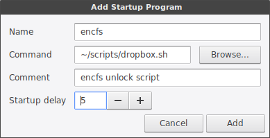

## Premise

Due to the fact that I now run Linux across my Homelab, Desktop and Laptop, I've been looking into keeping everything in sync.

Dropbox is reasonably popular for this on Linux systems (outside of P2P sync), but the issues, of course, is security. My mantra is if you put it on the internet assume that everyone can see it, and you can never remove it.

I wanted to use a Dropbox-style sync for a number of services (backup dotfiles, zim-wiki files, website code, etc). The intention was to be able to start something on the laptop, move to the desktop and be able to pick up where I left off.

## Dropbox install.

Installing Dropbox should be easy across most distributions from core repositories.

```
# Debain
cd ~ && wget -O - "https://www.dropbox.com/download?plat=lnx.x86_64" | tar xzf -
~/.dropbox-dist/dropboxd


# Arch
pacaur -S dropbox
```

## Setup script

First, put your password in a file in your home directory, plaintext. We will pass this as an argument to the script, and ensure it has permissions to be read only by your user.

You can modify the file location if you wish.

```
mkdir ~/.config/certificates/
echo "<password>" > ~/.config/certificates/encfs
chmod 0600 ~/.config/certificates/encfs
```

Then, create the script. Again, you can change the location.

_~/scripts/dropbox.sh_

```
cat ~/.config/certificates/encfs | encfs -S ~/Dropbox/encrypted/ ~/Private/
```

When called, this calls encfs, and supply the password by outputting the file created earlier into it.

Whilst there are a number of places we could call this upon startup to ensure its loaded upon startup, I chose the lazy option and just had it in my Cinnamon startup apps.



Now, place your files in the `~Private folder`. They will be encryped into the `~/Dropbox/encrypted/` folder. Repead on another computer to have shared sync.
