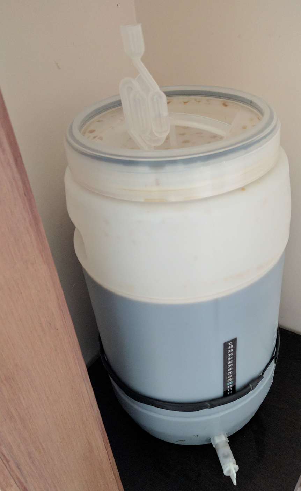

## Homebrewing again

After being inspired by a work colleague, I've decided to get back into homebrewing. I have actually done homebrewing for probably a combination of 2 years or so, but stopped due to moving state/house in the past and losing or giving away gear.

After grabbing a bit of a starting kit and building a favorite recipe from memory, a Primrose Milk Stout is fermenting away in the server cupboard.

Unfortunately, its been a pain to get temperature control correct. This means that I think its time to finally build what I always wanted to build: a fermenting fridge.

I'm now eyeing off a legacy [BrewPi](https://www.brewpi.com/) build, sans the fancy LCD controller and just using a Raspberry PI and a Arduino.
