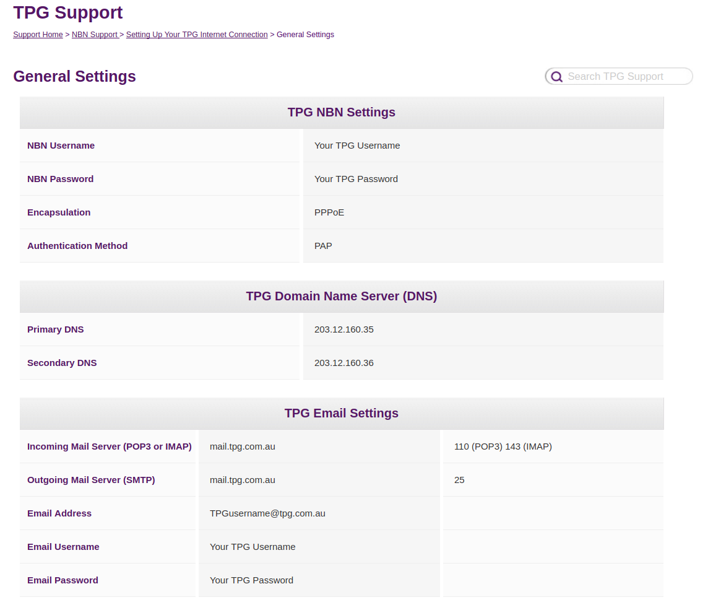
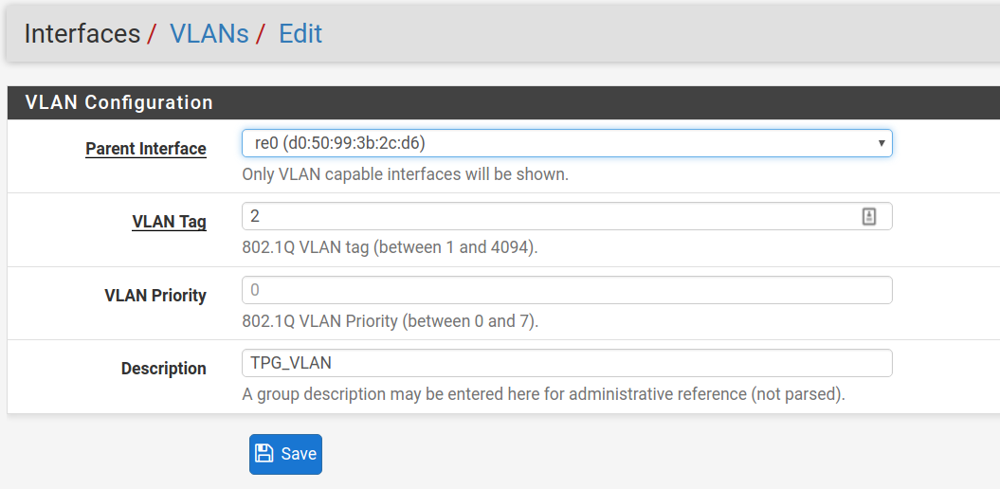
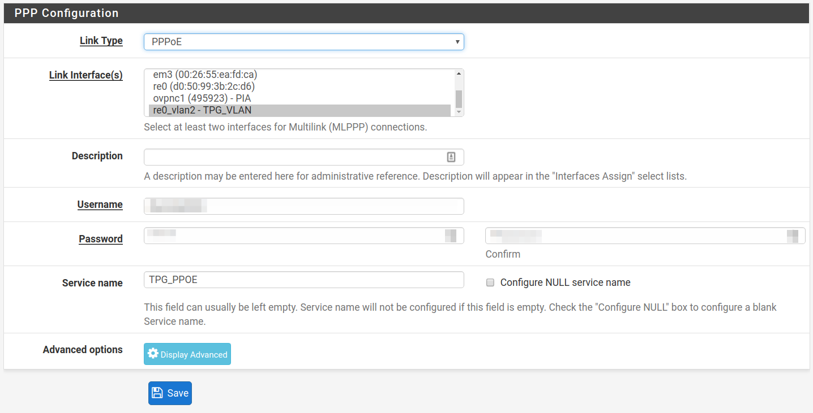
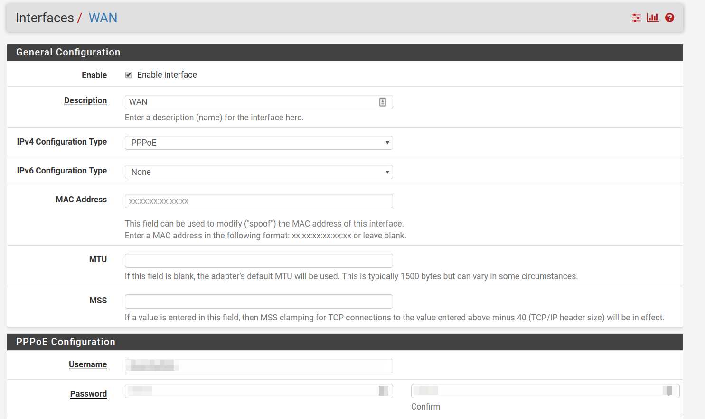
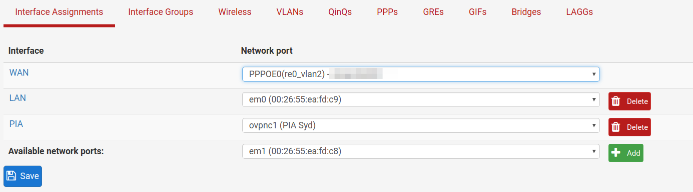

## Setting up pfSense for TPG NBN

After much frustration, I have finially buggered off the terrible HG659 router that is provided with TPG NBN.

I had significant trouble getting pfSense to connect to the NBN even using the details on their site. PPPoE should be reasonably simple, connect NBN box to pfSense WAN port, set to PPPoE and enter TPG username/password.

**Wrong!**

After quite some time I found that they use a VLAN setting, and without it being set right it would not connect at all. Its not mentioned in their setting site, conspicuously.

I got mine working once I set the WAN port to be on a VLAN 2.

Create a new VLAN, under _Interface -> Assign -> VLANs -> Add_. Setup on the WAN Interface (mine is `re0`) and with a VLAN tag of `2`.

Add a PPP configuration under _Interface -> Assign -> PPP -> Add_. Use Link type `PPPoE`, Link Interface of the VLAN you set up before. Enter TPG username/password

For WAN port, under _Interface -> WAN_, ensure we have `PPPoE` set for IP4 Configuration Type, and again your Username/Password

Then under _Interface -> Assign_, set the WAN network port to the PPPOE of the VLAN setup above.

You should now have a working NBN setup under pfSense, and that locked down modem can be thrown in the trash where it belongs!
