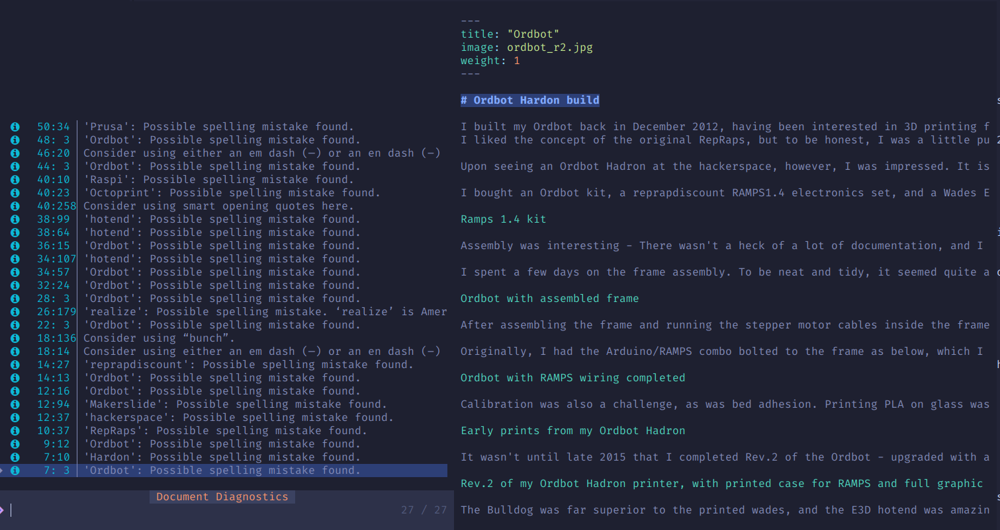
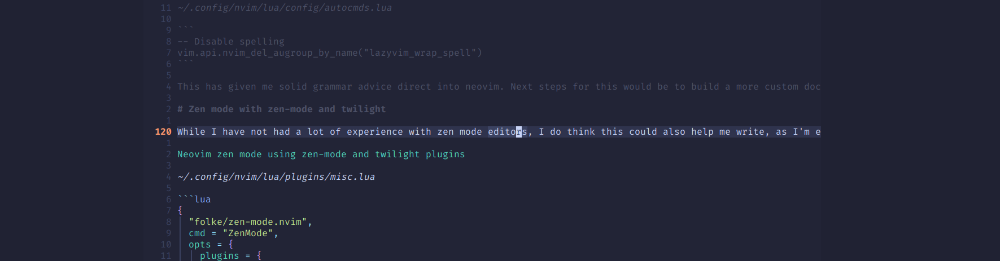

# Setting up nvim for writing

I've been getting into using nvim a lot of late, and thus wanted to integrate it well into my website workflow.

One fault I've seen in my older posts during my redesign was some spelling mistakes and poor grammar. I used to write in other editors and then copy & paste into Grammarly, which was cumbersome. Of course, this meant at times I would either forget or not be bothered to do so.

The other thing I used to find is because of how cumbersome it was to write I ended up not bothering to write.

So the goal of any new setup needed to be an easy as possible workflow for writing and getting the post to GitHub, and build in spell/grammar checking.

# Better language with ltex-ls, ltex-extra, and language-tools

As I was already running a [language-tools](https://languagetool.org/) docker instance in my cluster I was keen to utilise it as well, over sending my data out to another website for review.
I found [ltex-ls](https://www.google.com/search?q=ltex-ls) a good candidate for integrating spell/grammar checking, so I added it to my [Lazyvim](https://www.lazyvim.org/) config.

After some fiddling with it, I found that I wasn't able to add Neovim's default additional dictionary words to it—the docs show its able to load an external file for user added words. However, this isn't functional in `ltex-ls`. You can make a workaround by running lua to load the nvim user dictionary words, then pass them into the model. This doesn't reload unless you restart nvim, which can be a tad annoying as it adding a word doesn't remove the error until you restart nvim.

Using `ltex-extra` provides a wrapper to enable some of these functions and adds code actions. I was able to set up my nvim directory as the location for user added words, and it loaded this dictionary at load/new words being added.

So now, a `[d` or `]d` takes me to the next diagnostic, `<leader>cd` will show me a popup with the diagnostic text, and `<leader>ca` brings up code actions with proposed fixes or the ability to add words to the dictionary. `<leader>sd` will bring all document diagnostics in a telescope window.



First to add it in as a requirement for `Mason`.

_~/.config/nvim/lua/plugins/lsp.lua_

```diff
{
  "williamboman/mason.nvim",
  opts = function(_, opts)
    vim.list_extend(opts.ensure_installed, {
      "stylua",
      "selene",
      "luacheck",
      "shellcheck",
      "prettier",
      "shfmt",
      "black",
      "isort",
      "flake8",
+     "ltex-ls",
    })
  end,
},
```

Then to set it up in `nvim-lspconfig`
_~/.config/nvim/lua/plugins/lsp.lua_

```diff
  {
    "neovim/nvim-lspconfig",
    opts = {
      ---@type lspconfig.options
      servers = {
+       ltex = {
+         on_attach = function(client, bufnr)
+           print("Loading ltex from ltex_extra")
+           require("ltex_extra").setup({
+             init_check = true,
+             load_langs = { "en-AU" }, -- table <string> : language for witch dictionaries will be loaded
+             log_level = "error", -- string : "none", "trace", "debug", "info", "warn", "error", "fatal"
+             path = vim.fn.expand("~") .. "/.config/nvim/spell/",
+           })
+         end,
+         settings = {
+           ltex = {
+             completionEnabled = true,
+             statusBarItem = true,
+             languageToolHttpServerUri = "https://language-tools.trux.dev/",
+             checkFrequency = "save",
+             language = "en-AU",
+             additionalRules = {
+               enablePickyRules = true,
+             },
+           },
+         },
+       },
        ansiblels = {},
        bashls = {},
        dockerls = {},
        html = {},
        gopls = {},
        marksman = {},
        pyright = {
          enabled = false,
        },
        vimls = {},
      },
      setup = {},
    },
  },
```

And once satisfied in the results, disable Lazyvim's spellcheck, to avoid having two sets of spell checking occurring, especially as Neovim isn't aware of the user words you are adding via `ltex-extra`.

_~/.config/nvim/lua/config/autocmds.lua_

```
-- Disable spelling
vim.api.nvim_del_augroup_by_name("lazyvim_wrap_spell")
```

This has given me solid grammar advice direct into neovim. Next steps for this would be to build a more custom docker with specific [n-gram](https://dev.languagetool.org/finding-errors-using-n-gram-data) data.

# Zen mode with zen-mode and twilight

While I have not had a lot of experience with zen mode editors, I do think this could also help me write, as I'm easily distracted. `zen-mode` hides everything and just gives a reduced width view of just the text you are editing. `twilight` dims everything on the screen except the current block you are working on, helping you focus on your current text.



_~/.config/nvim/lua/plugins/misc.lua_

```lua
{
  "folke/zen-mode.nvim",
  cmd = "ZenMode",
  opts = {
    plugins = {
      gitsigns = true,
      tmux = true,
      kitty = { enabled = false, font = "+2" },
    },
  },
  keys = { { "<leader>z", "<cmd>ZenMode<cr>", desc = "Zen Mode" } },
},

-- twilight
{
  "folke/twilight.nvim",
  dependencies = {
    {
      "nvim-treesitter/nvim-treesitter",
    },
  },
},
```
