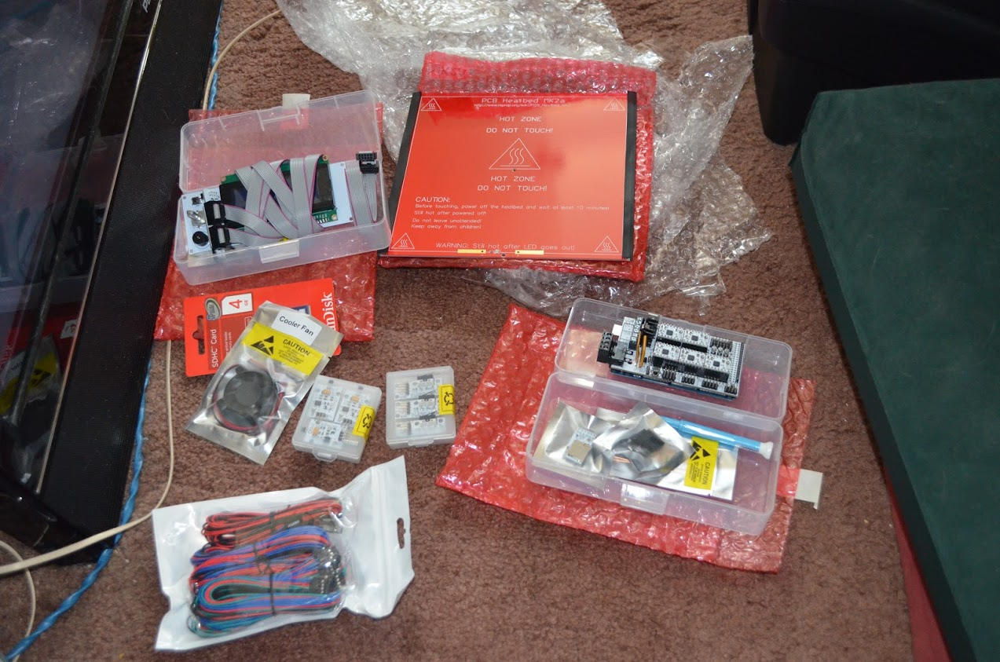
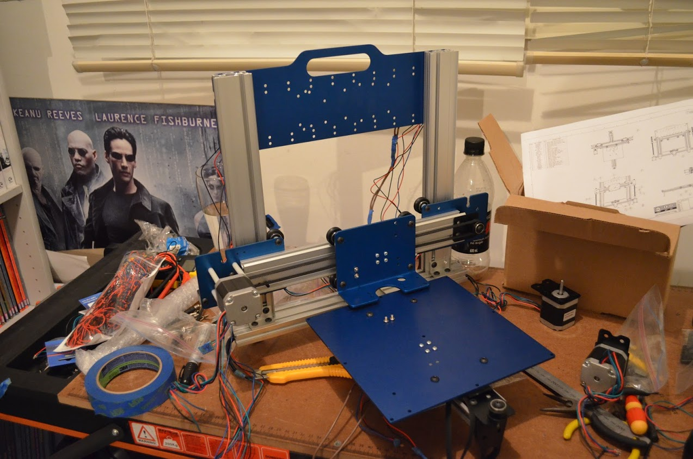
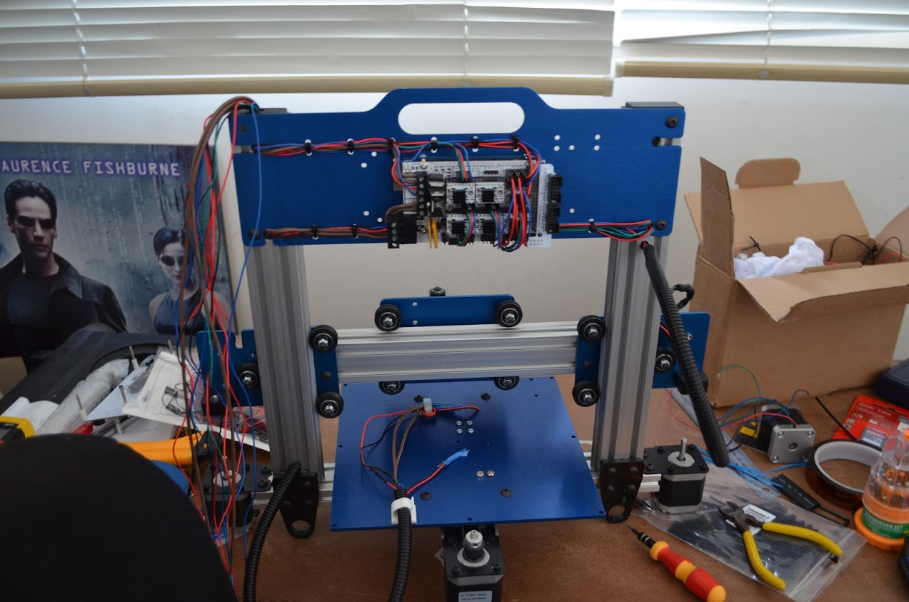
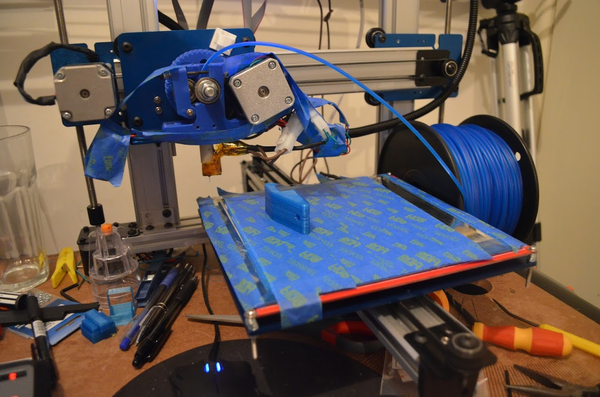
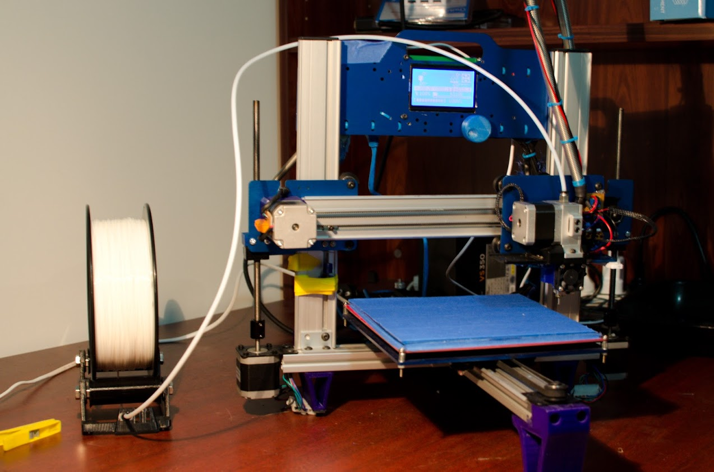
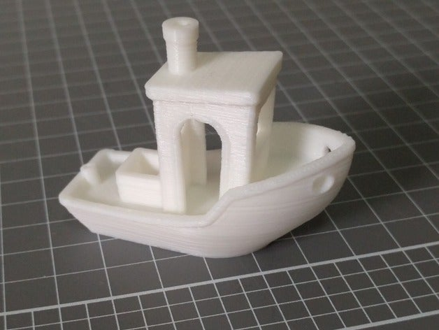
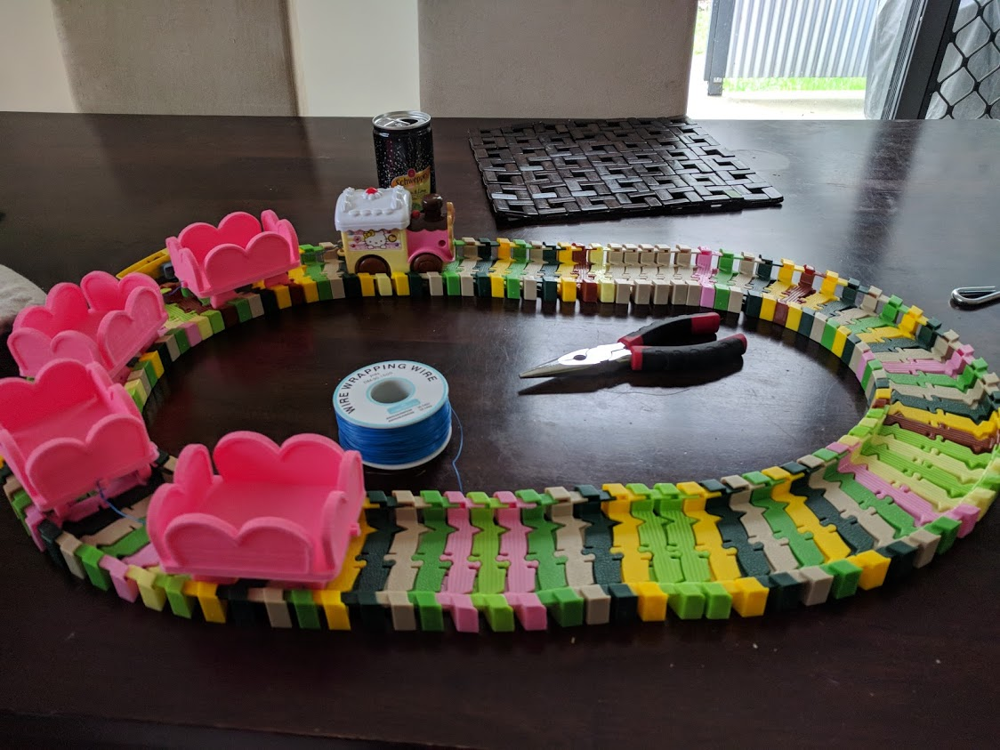

# Ordbot Hardon build

I built my Ordbot back in December 2012, having been interested in 3D printing for a few years.
I liked the concept of the original RepRaps, but to be honest, I was a little put off by how fragile they looked, and I had some concerns about the slop they may have.

Upon seeing an Ordbot Hadron at the hackerspace, however, I was impressed. It is made out of Makerslide and, at the time in 2012, was far more rigid than other models I had seen.

I bought an Ordbot kit, a reprapdiscount RAMPS1.4 electronics set, and a Wades Extruder kit to round out the basics.

Assembly was interesting - There wasn't a heck of a lot of documentation, and I found myself looking at the engineering drawings and a whole bunch of forum posts about similar builds.

I spent a few days on the frame assembly. To be neat and tidy, it seemed quite a few people drilled out holes in the frame to run cables in, which I proceeded to do.

After assembling the frame and running the stepper motor cables inside the frame, I took to wiring the electronics.

Originally, I had the Arduino/RAMPS combo bolted to the frame as below, which I later moved into its own case with a fan to help with cooling the steppers. At the time, I didn't realize how much active cooling they required!

Calibration was also a challenge, as was bed adhesion. Printing PLA on glass was all the rage in 2012, but I could never get it to stick well. Blue painter's tape ended up being my go-to.

It wasn't until late 2015 that I completed Rev.2 of the Ordbot - upgraded with a Bulldog Extruder, E3D v6 hotend, printed case + fan for the RAMPS, and a Full Graphic display for the LCD.

The Bulldog was far superior to the printed wades, and the E3D hotend was amazing compared to the hotend I started with (which I can't even recall now).

Later, a Raspi 3 with Octoprint came along, and I printed a case for it that I tacked onto the back of the printer. Since I never designed the rear of the case for the amount of gear I was trying to fit in, I honestly never managed to get it neat and tidy. "Working" became the main goal.

That said, after plenty of tuning, fiddling with the Marlin firmware, etc., I was able to get decent prints from it.

It got some decent use - for example, I printed 80 sculpture pieces for a friend's wedding, as well as love heart train carts for my step-daughter's birthday. During arts and crafts activities, we could have a moving train delivering glitter and pens to everyone.

However, with the arrival of the Prusa MK3s in the household, it is now fully dismantled, awaiting its upgrade to Rev3.
